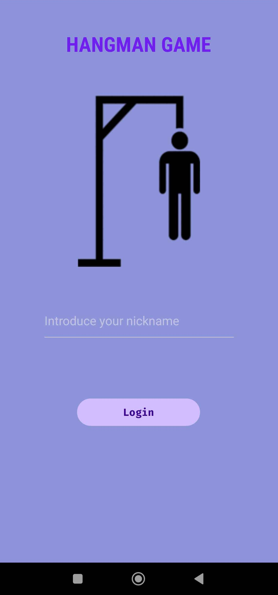
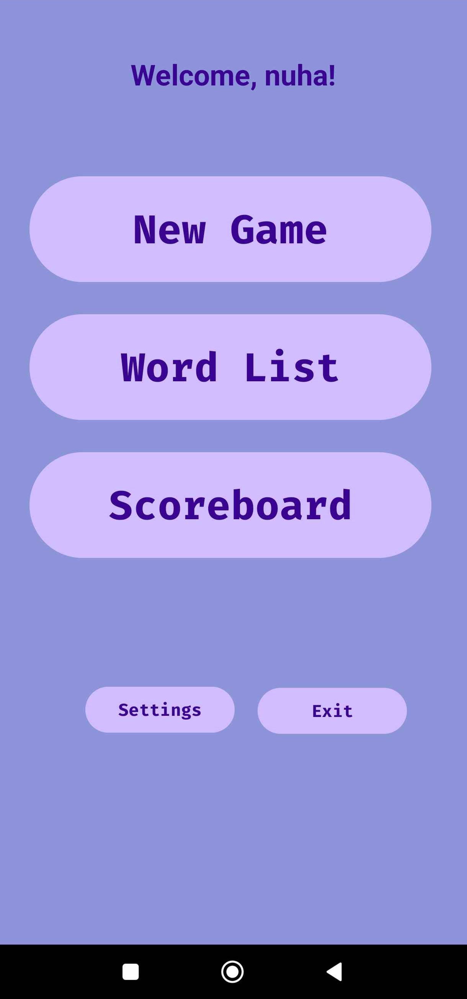
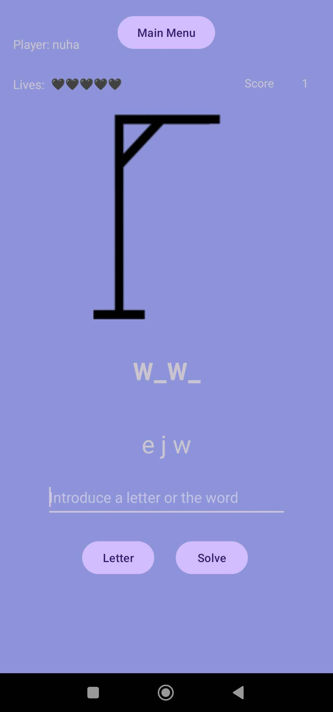
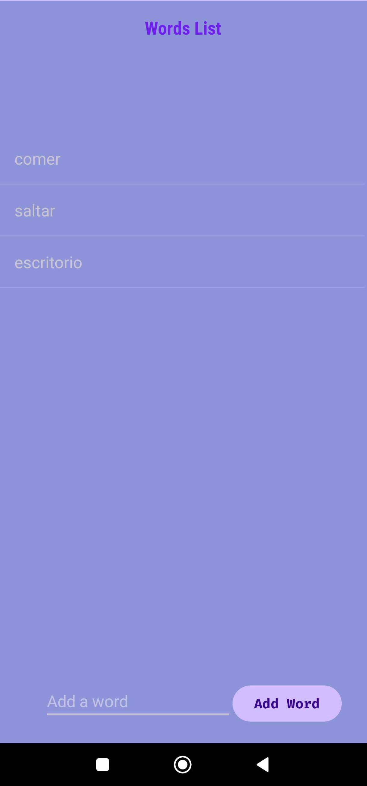

# Hangman Game Android

## Overview
This is an Android application for the classic Hangman game. The game allows players to guess letters to uncover a hidden word. Players have a limited number of incorrect guesses before the game is over.

## Features
- Login screen to enter a player nickname



- Navigate through the main menu to start a new game, view high scores, or manage the word list



- Start a new game with a random word from the word list
- Guess letters to uncover the hidden word
- Track incorrect guesses with a health bar
- Display a hangman image that updates with each incorrect guess
- Show the hidden word when the game is over
- Option to start a new game



- Display a list of high scores
- Save high scores to a local database

- Add words to the word list
- Remove words from the word list



## Installation
1. Clone the repository:
    ```sh
    git clone https://github.com/AfroOrange/hangman-game-android.git
    ```
2. Open the project in Android Studio.
3. Build and run the project on an emulator or physical device.

## Usage
1. Enter your nickname on the login screen.
2. Click "New Game" to start a new game.
3. Guess letters by entering them in the input field and clicking the "Guess" button.
4. The game will update the hidden word and hangman image based on your guesses.
5. If you guess the word correctly, you win. If you reach the maximum number of incorrect guesses, the game is over.
6. Click "New Game" to start a new game or "Main Menu" to return to the main menu.

## License
This project is licensed under the MIT License. See the `LICENSE` file for more details.